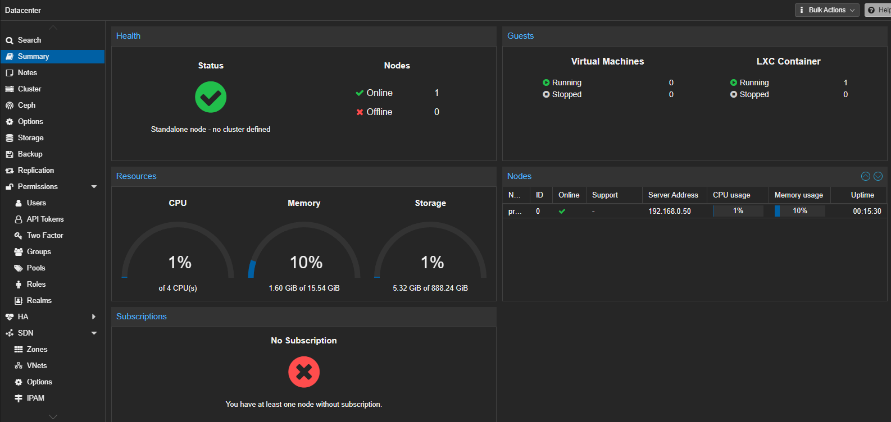
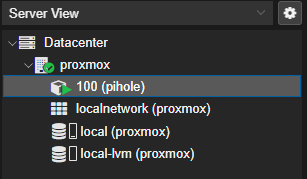

# Homelab Overview

A cybersecurity and IT administration homelab running on a repurposed office PC, started July 4, 2026. Built as a hands-on environment for practicing defensive security and sysadmin skills, and as a portfolio piece.

Full write-up with reasoning, hardware specs, and environment details: [Homelab Proxmox and Pi-hole Environment Documentation July 8th.pdf](Homelab%20Proxmox%20and%20Pi-hole%20Environment%20Documentation%20July%208th.pdf)

## Why this project exists

Built to have a real, hands-on environment for cybersecurity and IT administration practice, rather than just studying concepts in isolation. It doubles as a portfolio piece since employers in defensive security and sysadmin roles care about seeing actual infrastructure work, not just certifications or coursework. It's also a genuinely good vehicle for honing skills from University coursework and experimenting with areas I enjoy.

## Why Proxmox

Chose Proxmox VE over alternatives like ESXi or running everything in Docker on bare Linux for two main reasons. It's free and open source, so there's no licensing cost or restriction getting in the way of experimenting. It also gives real flexibility between full VMs and lightweight LXC containers on the same host, mirroring the kind of virtualization environment expected in an actual IT admin or sysadmin role. Prior academic experience with Proxmox also allowed for an accelerated deployment timeline.

## Why an old office PC instead of dedicated hardware

The machine hosting all of this is a repurposed office PC rather than something bought specifically for homelabbing. This kept the cost of the project at basically zero, and forces real thinking about resource constraints, working with 16GB of RAM total rather than an unlimited compute budget. Deciding what runs full time versus on demand is its own kind of practical systems administration skill.

Total hardware cost: $0.

## Physical setup

Sits next to my main desktop. Runs headless, no monitor, mouse, or keyboard plugged in, everything is managed through the Proxmox web UI over the local network.

## Hardware specifications

| Component | Detail |
|---|---|
| CPU | Intel Core i5-6600 @ 3.30GHz, 4 cores, 1 socket |
| RAM | 15.54 GiB total |
| Storage | 1TB external SSD |
| Swap | 8.00 GiB |
| Boot mode | EFI |
| Hypervisor | Proxmox VE, pve-manager 9.2.2 |
| Kernel | Linux 7.0.2-6-pve |

At the time of writing, the host runs comfortably under load: 0.76% CPU usage across 4 cores, 10.29% RAM usage (1.60 GiB of 15.54 GiB), 4.57% disk usage on the root filesystem, and 0% swap usage. Future VMs like Wazuh will run on demand rather than powered on 24/7.

The host currently has a single physical network interface. A USB Ethernet adapter has been sourced to provide the dedicated second interface pfSense will need, separate from general LAN traffic.

## Environment overview

Currently running one LXC container, named pihole, on Debian 12, documented in [-HOMELAB-DNS-Privacy-Stack](https://github.com/homeslashsean/-HOMELAB-DNS-Privacy-Stack). Uses a single storage pool built on the 1TB external SSD for now. As more VMs get added, storage and RAM allocation will need to be tracked more carefully since the 16GB ceiling is a real constraint.

## Remote collaboration access

As collaborators join the project, network-level access needs to be granted without exposing the home network broadly or handing out direct credentials to internal infrastructure.

The approach used is a Tailscale subnet router, deployed as a dedicated lightweight LXC container rather than installed directly on the Proxmox host. This keeps the hypervisor itself untouched by the remote access layer and isolates that role to a single-purpose container.

Rather than granting full LAN access, collaborator devices are tagged and restricted through Tailscale's access control policy to only the specific services they need, scoped by IP and port rather than by subnet. Everything else on the network remains unreachable to a tagged device, regardless of what the underlying subnet route technically covers, the ACL is the actual enforcement boundary, not the route itself.

This is intentionally a temporary, software-level boundary. Once host hardening and a dedicated pfSense/OPNsense router are in place, this will be replaced with real network segmentation (VLANs), moving the boundary from an access-control policy to physical network architecture.

Proxmox-level permissions (scoped users, resource pools) are the next layer planned, so collaborator access to specific VMs/containers can be similarly restricted at the hypervisor level, not just the network level.

## Security posture

The host itself hasn't been hardened yet. This is next on the list, alongside setting up pfSense. Planned steps include restricting web UI access to LAN only and enabling 2FA on the root account.

## Planned next steps

- Harden the Proxmox host itself (restrict web UI access, enable 2FA)
- pfSense VM
- Wazuh SIEM
- Kali Linux VM
- Jellyfin with GTX 960
