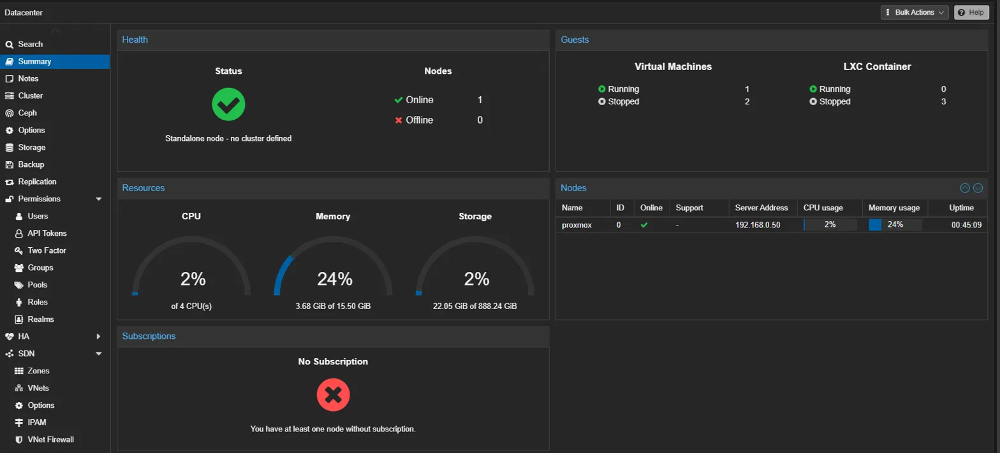
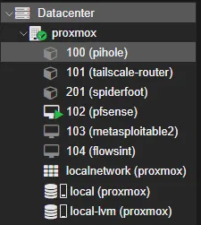

# Homelab Overview

A cybersecurity and IT administration homelab running on a repurposed HP EliteDesk, started July 4, 2026. Built as a hands-on environment for practicing defensive security and sysadmin skills, and as a portfolio piece. This repo is the hub: it covers the host and how the pieces fit together, and links out to the individual projects.

Full write-up with reasoning, hardware specs, and architecture: [Homelab-Overview-Oct-2026.pdf](Homelab-Overview-Oct-2026.pdf)
Original July 2026 write-up (Proxmox + Pi-hole snapshot): [Homelab Proxmox and Pi-hole Environment Documentation July 8th.pdf](Homelab%20Proxmox%20and%20Pi-hole%20Environment%20Documentation%20July%208th.pdf)

## Projects

| Project | What it does | Repo |
|---|---|---|
| DNS privacy stack | Pi-hole ad/tracker filtering with Unbound recursive resolution and DNSSEC validation, no third-party resolver | [-HOMELAB-DNS-Privacy-Stack](https://github.com/homeslashsean/-HOMELAB-DNS-Privacy-Stack) |
| Network segmentation | pfSense VM providing an isolated, filtered LAN segment behind the existing consumer router | [-HOMELAB-pfSense-Network-Segmentation](https://github.com/homeslashsean/-HOMELAB-pfSense-Network-Segmentation) |
| Power optimization | Idle power baseline and C-state analysis of the host | [Homelab-Power-Optimization-Oct-2026.pdf](Homelab-Power-Optimization-Oct-2026.pdf) |

## Architecture

```
Internet (single wall Ethernet drop, no modem)
    |
TP-Link Archer -- 192.168.0.0/24 -- Wi-Fi, TVs, household devices
    |
Proxmox host (onboard NIC -> vmbr0)
    |-- LXC 100: Pi-hole + Unbound (192.168.0.2)
    |-- LXC: Tailscale subnet router (collaborator access)
    |-- VM: pfSense
          WAN (vtnet0) on vmbr0, DHCP lease from the Archer
          LAN (vtnet1) on vmbr1 -> USB RTL8153 -> unmanaged switch
                |
          192.168.10.0/24 -- gaming PC (Raspberry Pi planned)
```

The Archer keeps routing the rest of the household exactly as before. Only devices deliberately plugged into the switch sit behind pfSense, and their DNS is forwarded through pfSense to Pi-hole/Unbound.

## Why this project exists

Built to have a real, hands-on environment for cybersecurity and IT administration practice, rather than just studying concepts in isolation. It's also a genuinely good vehicle for honing skills from University coursework and experimenting with areas I enjoy. Homelabbing/self-hosting is a fascinating idea to me, and most importantly, it's fun to do!

## Why Proxmox

Chose Proxmox VE over alternatives like ESXi or running everything in Docker on bare Linux for two main reasons. It's free and open source, so there's no licensing cost or restriction getting in the way of experimenting. It also gives real flexibility between full VMs and lightweight LXC containers on the same host, mirroring the kind of virtualization environment expected in an actual IT admin or sysadmin role. Prior academic experience with Proxmox also allowed for an accelerated deployment timeline.

## Why an old office PC instead of dedicated hardware

The machine hosting all of this is a repurposed office PC rather than something bought specifically for homelabbing. This kept the cost of the project at basically zero, and forces real thinking about resource constraints, working with 16GB of RAM total rather than an unlimited compute budget. Deciding what runs full time versus on demand is its own kind of practical systems administration skill.

Total hardware cost: $0.

## Physical setup

Sits next to my main desktop. Runs headless, no monitor, mouse, or keyboard plugged in, everything is managed through the Proxmox web UI over the local network.

## Hardware specifications

| Component | Detail |
|---|---|
| Machine | HP EliteDesk (repurposed office PC) |
| CPU | Intel Core i5-6600 @ 3.30GHz, 4 cores, 1 socket |
| RAM | 15.54 GiB total |
| Storage | 1TB external SSD |
| Swap | 8.00 GiB |
| Network | Onboard NIC (pfSense WAN side) + USB RTL8153 (pfSense LAN side) |
| Switch | TP-Link LS1005G 5-port unmanaged gigabit |
| GPU | GTX 960, currently removed for power testing, reserved for planned Jellyfin passthrough |
| Boot mode | EFI |
| Hypervisor | Proxmox VE, pve-manager 9.2.2 |
| Kernel | Linux 7.0.2-6-pve |

Current load: [fill in from new screenshot: CPU %, RAM used of 15.54 GiB, disk %]. Future VMs like Wazuh will run on demand rather than powered on 24/7.



## Environment overview

Currently running:

- **LXC 100, pihole** (Debian 12): Pi-hole + Unbound, documented in [-HOMELAB-DNS-Privacy-Stack](https://github.com/homeslashsean/-HOMELAB-DNS-Privacy-Stack)
- **LXC, Tailscale subnet router**: collaborator access, described below
- **VM, pfSense** (2 vCPU, 2GB RAM, 16GB disk): documented in [-HOMELAB-pfSense-Network-Segmentation](https://github.com/homeslashsean/-HOMELAB-pfSense-Network-Segmentation)

Everything uses a single storage pool on the 1TB external SSD for now. As more VMs get added, storage and RAM allocation need to be tracked more carefully since the 16GB ceiling is a real constraint.



## Remote collaboration access

As collaborators join the project, network-level access needs to be granted without exposing the home network broadly or handing out direct credentials to internal infrastructure.

The approach used is a Tailscale subnet router, deployed as a dedicated lightweight LXC container rather than installed directly on the Proxmox host. This keeps the hypervisor itself untouched by the remote access layer and isolates that role to a single-purpose container.

Rather than granting full LAN access, collaborator devices are tagged and restricted through Tailscale's access control policy to only the specific services they need, scoped by IP and port rather than by subnet. Everything else on the network remains unreachable to a tagged device, regardless of what the underlying subnet route technically covers, the ACL is the actual enforcement boundary, not the route itself.

This is intentionally a temporary, software-level boundary. pfSense now exists, but it runs as an isolated segment rather than the household router, so the ACL is still the real boundary for collaborator access. Moving that boundary into network architecture (VLANs) depends on host hardening and on the pfSense segment growing or moving to dedicated hardware.

Proxmox-level permissions (scoped users, resource pools) are the next layer planned, so collaborator access to specific VMs/containers can be similarly restricted at the hypervisor level, not just the network level.

## Security posture

The Proxmox host itself hasn't been hardened yet. Planned steps include restricting web UI access to LAN only and enabling 2FA on the root account. The pfSense VM has had a light hardening pass: WebGUI unreachable from WAN, SSH disabled, login protection enabled, and updated to 2.8.1. Details are in the pfSense repo.

## Power

Measured idle CPU package power (turbostat, not wall power):

| State | Package power |
|---|---|
| GTX 960 installed, pfSense on | ~11.1 W |
| GTX 960 removed, pfSense on | ~4.7 W |
| GTX 960 removed, pfSense off | ~1.1 W |

The package never reaches deep sleep states (PC6/PC7) in any configuration, which is still being investigated. Full method, caveats, and next steps: [Homelab-Power-Optimization-Oct-2026.pdf](Homelab-Power-Optimization-Oct-2026.pdf).

## Planned next steps

- Harden the Proxmox host itself (restrict web UI access, enable 2FA)
- pfSense: firewall rule tightening, more devices on the switch (Raspberry Pi next), VLANs and Suricata/Snort evaluation
- Power: investigate the package C-state cap (BIOS and ASPM), reduce pfSense VM wakeups, take a wall power reading
- Wazuh SIEM
- Kali Linux VM
- Jellyfin with GPU passthrough (GTX 960)
- Proxmox-level scoped users and resource pools
- Possible future project: dedicated always-on low-power hardware for pfSense

## Updates

- **October 2026:** Power optimization baseline added ([PDF](Homelab-Power-Optimization-Oct-2026.pdf)). Overview rewritten to cover the pfSense segment and the Pi-hole/Unbound stack as separate project repos.
- **August 2026:** pfSense deployed as an isolated LAN segment ([repo](https://github.com/homeslashsean/-HOMELAB-pfSense-Network-Segmentation)).
- **July 2026:** Proxmox host, Pi-hole + Unbound, and Tailscale collaborator access.
